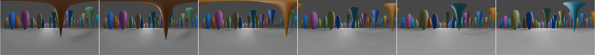

# blender-spherical-video

Scripts for [Blender](https://blender.org) to render 360-degree spherical videos.  See [`examples/exampleBasic.avi`](examples/exampleBasic.avi) for an example spherical video, and [`examples/exampleBasicOverview.mov`](examples/exampleBasicOverview.mov) for an overview of what the camera is doing in that example.



Given a Blender file and a camera in that file, the `sphericalVideo.py` script renders each frame of the file's animation as images on a cube around the camera.  It then resamples those images to make a sphere, and unwraps the sphere into a flat image, like a flat map of the spherical Earth.  Map makers have developed a variety of ways to convert a sphere into a flat image, and two are supported:
* [equirectangular projection](https://en.wikipedia.org/wiki/Equirectangular_projection), which is appropriate for most uses;
* [Mercator projection](https://en.wikipedia.org/wiki/Mercator_projection), which may be useful in some cases.

In the final spherical image, the view along the positive _x_ axis is in the middle, the view along the positive _y_ axis is to the left of the middle, and the view along the positive _z_ axis is at the top.

The [Cycles](https://docs.blender.org/manual/en/latest/render/cycles/index.html) ray-tracing renderer in Blender can produce spherical videos directly, if the camera "Type" is set to "Panoramic" and "Panorama Type" is set to "Equirectangular".  But this approach is very slow, especially because avoiding noise artifacts in the images usually requires a large number of samples per pixel (e.g, at least 1024, even with final denoising enabled).  The `blender-spherical-video` system can work with any renderer, and with the [Eevee](https://docs.blender.org/manual/en/latest/render/eevee/index.html) scanline renderer it produces good results quite quickly.

The `blender-spherical-video` system works in a number of versions of Blender (2.79 and 2.81, in particular, have been verified).

## Usage

To render the example, open a terminal shell and run the following:
```
blender --background --python blender-spherical-video/sphericalVideo.py  -- -i examples/exampleBasic.blend -o /tmp/example
```

The frames of the final spherical video will be in `/tmp/example/spherical`, and the intermediate frames from the cube faces will be in directories like `/tmp/example/xNeg`, `/tmp/example/yPos`, etc.   A directory of cache files to speed up subsequent runs will be created in `blender-spherical-video/samplingIndexCache`, assuming that the `blender-spherical-video` subdirectory is writable.

To assemble the final frames into a video, run the following:
```
blender --background --python blender-spherical-video/assembleFrames.py  -- -i /tmp/example/spherical -iw 1280 -ih 720
```
The result is the movie file `/tmp/example/spherical/0001-0096.avi`.  The `assembleFrames.py` script used here matches that in [neuVid](https://github.com/connectome-neuprint/neuVid).

## Usage Options

The `-i` and `-o` options in the usage example, above, are two of several options the `sphericalVideo.py` script supports:

`--input` (or `-i`): the path to the Blender file

`--output` (or `-o`, default value: `./spherical-video`): the path to the output directory

`--camera` (or `-c`, default value: `"Camera"`): the name of the camera in the input Blender file to use for rendering

`--width` (or `-ow`, default value: `1280`): the width of the final spherical images

`--height` (or `-oh`, default value: `720`): the height of the final spherical images

`--cubeSize` (or `-cs`, default value: the maximum of `0.75` times the width and height of the final spherical images): the width (and height) of the intermediate cube face images

`--subWidth` (or `-sw`, default value: 3): the number of horizontal subsamples to use when computing a pixel in the sphere image from pixels in the cube face images

`--subHeight` (or `-sh`, default value: 3): like `--subWidth` but for vertical subsamples

`--frame-start` (or `-s`, default value: what is set in the Blender file): the first frame of the animation to render

`--frame-end` (or `-e`, default value: what is set in the Blender file): the last frame of the animation to render

`--frame-jump` (or `-j`, default value: what is set in the Blender file): the number of frames to advance when rendering

`--proj` (or `-pr`, default value: 0): the type of projection to use when converting the sphere into a flat image, with 0 indicating equirectangular projection and 1 indicating Mercator projection

`--nocache` (or `-nc`): disable caching


## Testing

To run the unit tests, open a terminal shell and run the following:
```
blender --background --python blender-spherical-video/test_sphericalVideo.py
```
A successful run of the tests should produce output similar to the following:
```
Blender 2.81 (sub 16) (hash f1aa4d18d49d built 2019-12-04 14:33:18)
Read prefs: /Users/hubbardp/Library/Application Support/Blender/2.81/config/userpref.blend
found bundled python: /Applications/Blender-2.81a.app/Contents/Resources/2.81/python
......
----------------------------------------------------------------------
Ran 6 tests in 3.899s

OK
```
It also will create a test image `test_createImage.png` in the current directory.
